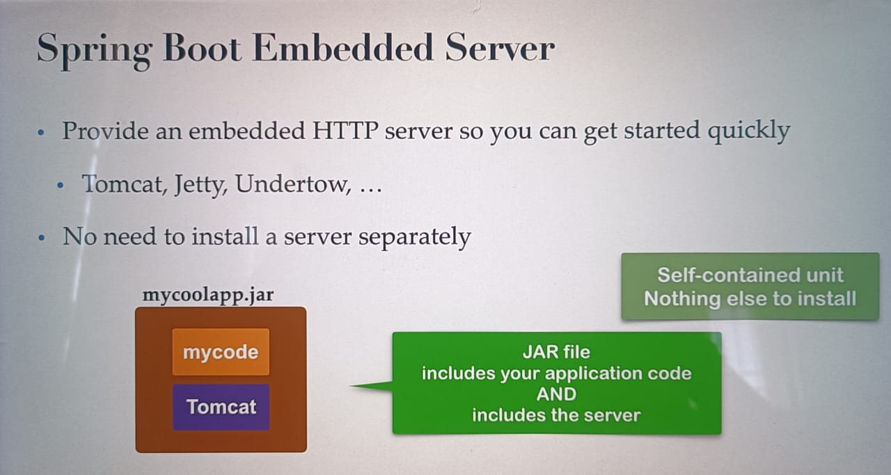
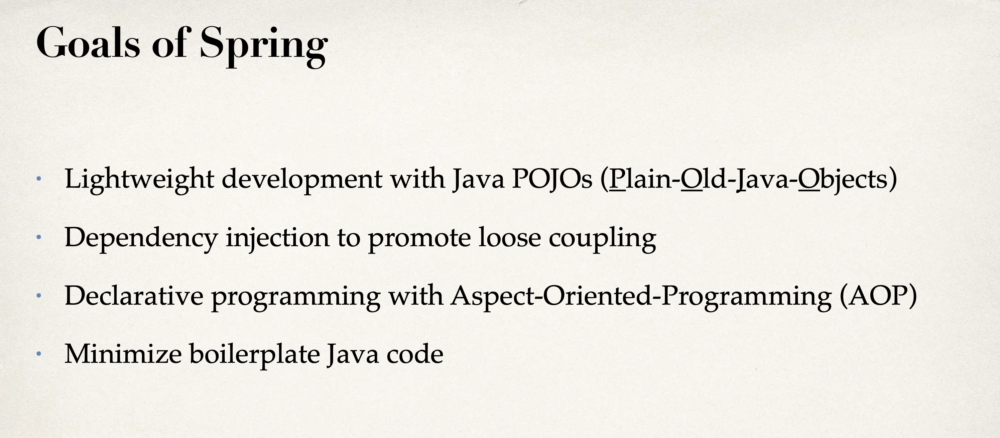

# Introduction

## Spring in a Nutshell:

1. Spring is a very popular java framework
2. It provides a large number of annotations and helper classes

## The Problem:

1. Building a traditional spring application is very hard
2. Which JAR dependencies? Which configurations(XML or JAVA)?
3. How do I install the server? (Tomcat or JBoss etc)

## Spring Boot Solution:

1. Spring boot makes it easier to get started with development.
2. Minimize the amount of manual configurations
3. Spring boot perform auto configurations based on property files and JAR classpath
4. Helps to resolve dependency conflicts(Maven or Gradle)
5. Provide embedded server, so we can start quickly

## Relation between Spring and Spring Boot:

1. Spring boot uses spring behind the scenes
2. Spring boot simply makes it easier to use spring

## Spring Initializer

1. Visit **https://start.spring.io/**
2. Select your dependencies and create a project!

## Spring Boot Embedded Server:

## Running Spring Boot Applications:

1. Spring boot apps can run standalone(includes embedded server)
2. We can run spring boot app from command line or IDE
3. From command line run: java -jar my_app.jar

## Deploying Spring boot application:

1. Spring boot apps can also be deployed in traditional way
2. Deploy war file to external server (Tomcat, JBoss, WebSphere etc)

## Goals of Spring:

# What is Maven:

1. When you generate projects using Spring Initializr: start.spring.io, it can generate a Maven project for you.
2. In this section, we will learn the basics of Maven Viewing dependencies in the Maven pom.xml file Spring Boot Starters for Maven
