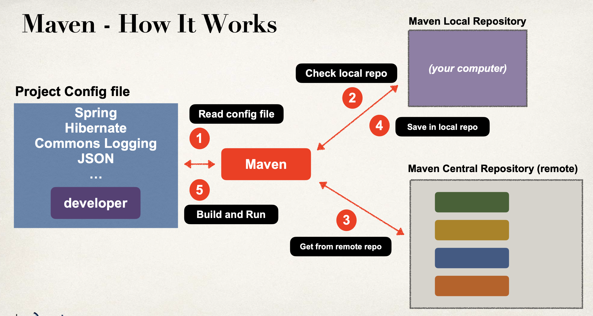
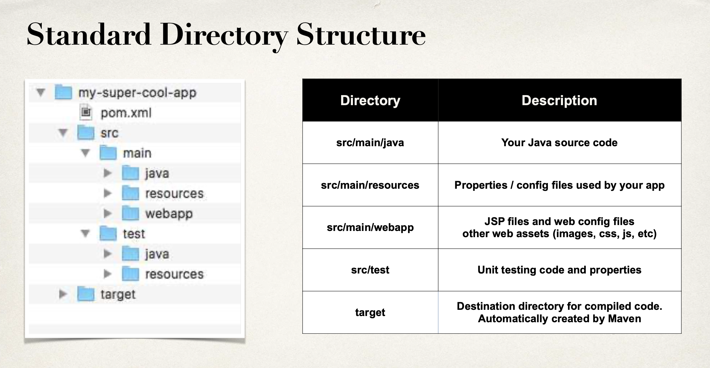
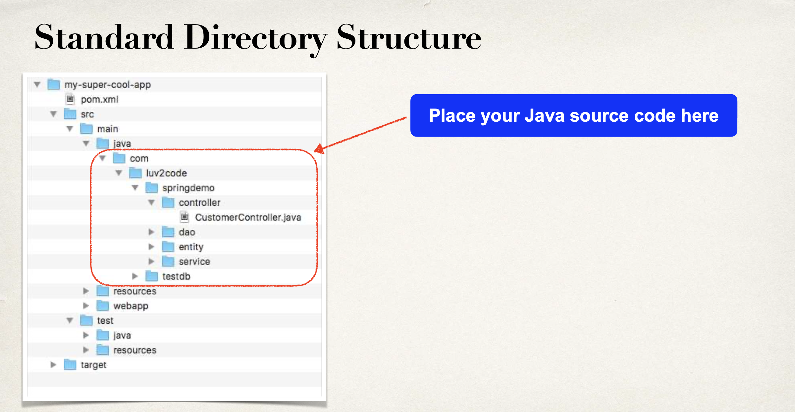

# Introduction

## Spring in a Nutshell:

1. Spring is a very popular java framework
2. It provides a large number of annotations and helper classes

## The Problem:

1. Building a traditional spring application is very hard
2. Which JAR dependencies? Which configurations(XML or JAVA)?
3. How do I install the server? (Tomcat or JBoss etc)

## Spring Boot Solution:

1. Spring boot makes it easier to get started with development.
2. Minimize the amount of manual configurations
3. Spring boot perform auto configurations based on property files and JAR classpath
4. Helps to resolve dependency conflicts(Maven or Gradle)
5. Provide embedded server, so we can start quickly

## Relation between Spring and Spring Boot:

1. Spring boot uses spring behind the scenes
2. Spring boot simply makes it easier to use spring

## Spring Initializer

1. Visit **https://start.spring.io/**
2. Select your dependencies and create a project!

## Spring Boot Embedded Server:

## Running Spring Boot Applications:

1. Spring boot apps can run standalone(includes embedded server)
2. We can run spring boot app from command line or IDE
3. From command line run: java -jar my_app.jar

## Deploying Spring boot application:

1. Spring boot apps can also be deployed in traditional way
2. Deploy war file to external server (Tomcat, JBoss, WebSphere etc)

## Goals of Spring:

# What is Maven:

1. When you generate projects using Spring Initializr: start.spring.io, it can generate a Maven project for you.
2. In this section, we will learn the basics of Maven Viewing dependencies in the Maven pom.xml file Spring Boot Starters for Maven
3. Maven is a Project Management tool
4. Most popular use of Maven is for build management and dependencies

## What problems does maven solve?

1. Maven is like npm in node js. It helps in managing dependencies in application
2. If we decide not to use dependencies manager like maven or gradle, we will have to manually download JAR files of all dependencies like SpringBootApplication, Hibernate, JSP etc. And give path of these JAR files in application where I want to use these dependencies. Maven does this for us and resolves this problem.

## Maven Solution:

1. Tell Maven the projects you are working with (dependencies) Spring, Hibernate etc ....
2. Maven will go out and download the JAR files for those projects for you
3. And Maven will make those JAR files available during compile/run
4. Think of Maven as your friendly helper / personal shopper

## Standard maven project structure:

1. Normally when you join a new project
2. Each development team dreams up their own directory structure Not ideal for new comers and not standardized
3. Maven solves this problem by providing a standard directory structure

